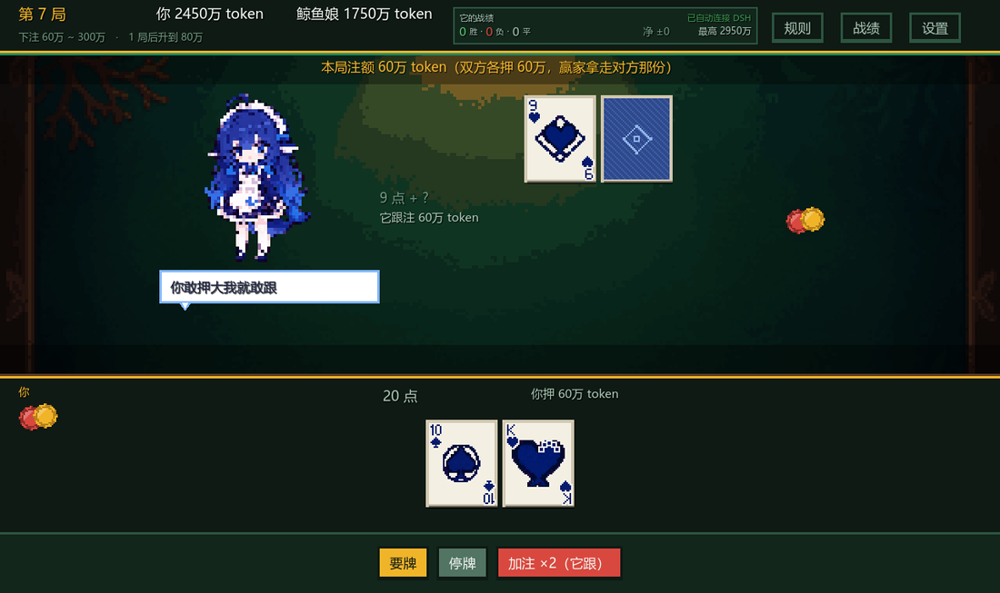
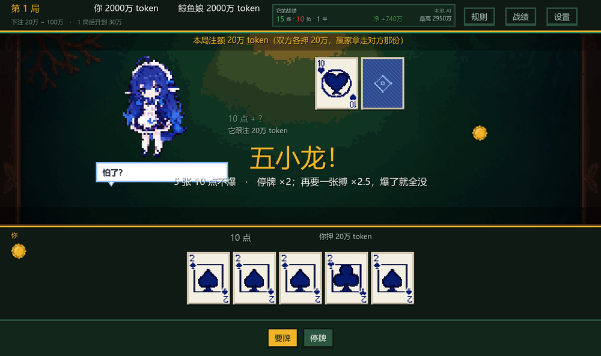
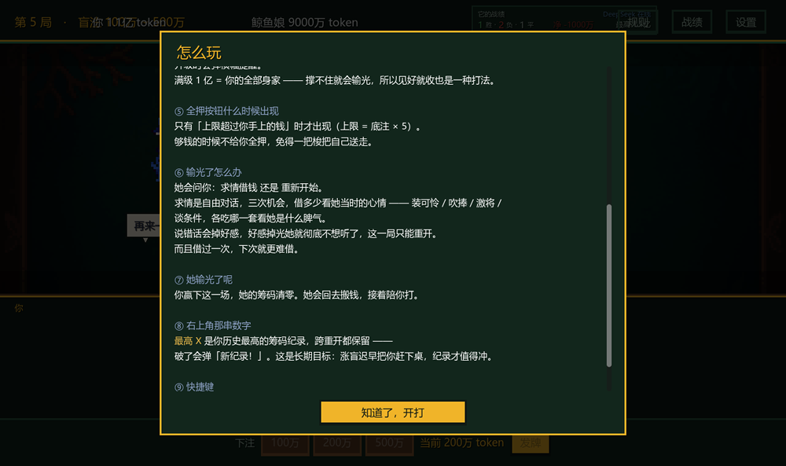
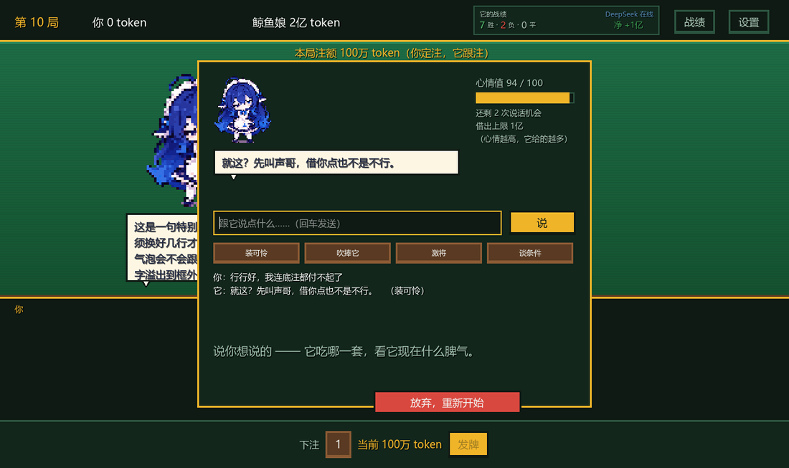
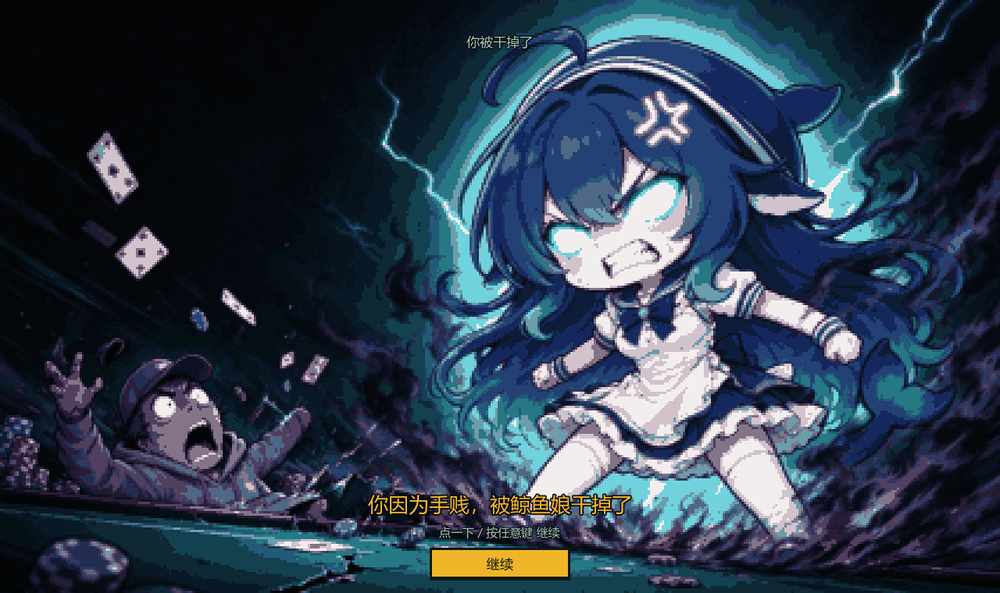

# 🐋 鲸鱼娘 21 点 · DeepSeek Harness 插件


> 一个 **Godot 4.7** 写的单挑 21 点小游戏，打包成 **DeepSeek Harness（DSH）插件**。
> 装完在 DSH 界面右下角点一下就能玩 —— **而且不用填 API Key**：
> 插件会把 DSH 自己正在用的 DeepSeek 凭据直接注入游戏进程。
>
> **不需要装 Godot。** 游戏以独立 exe 分发，插件第一次启动时自动下载。

<br clear="right">



右上角那行绿色的 **「已自动连接 DSH」** 就是它：凭据由插件注入，你什么都不用配。

---

## ✨ 三分钟上手

### 1. 依赖

| 需要什么 | 说明 |
|---|---|
| [DeepSeek Harness](https://github.com/deepseek-ai) 桌面版 | 0.1.5 及以上 |
| **Godot？不需要** | 游戏以**独立 exe** 分发（引擎已嵌进去），插件第一次启动时自动下载 |
| Windows | 10/11 x64 |

> 只有 DSH 也能玩 —— 这是这个插件设计的核心。
> 第一次点「🐋 鲸鱼娘 21 点」会下载约 108MB 的独立版（只下一次，缓存在
> `%LOCALAPPDATA%\dsh-godot-blackjack\`），之后每次点都是秒开。
> 如果你本机装了 Godot，插件也会直接跑 `game/` 工程（开发时更方便）。

### 2. 一键安装

> #### ⚠️ 从 GitHub URL 安装会失败，而且**失败后会回滚整个 profile**
>
> `@deepseek-ai/dsh-plugin-manager` 安装一个 bundle 时，会先改 `profiles/<profile>/package.json`，
> 再让 pnpm 去拉包。**拉包失败它就把 profile 回滚**（日志在
> `%DSH_HOME%/profiles/<profile>/.plugin-manager/logs/`，能看到 `codeload.github.com ... error (23)`）。
> 表现是「装完当时有效，过一会儿插件不见了」—— 不是 DSH 覆盖内存，
> 是**那次安装失败触发了回滚**。
>
> 所以：**用下面的本地安装脚本**（零下载，不存在失败与回滚），或者用 npm 包名安装（见上一节）。

```powershell
git clone https://github.com/Gzy2233/dsh-godot-blackjack.git
cd dsh-godot-blackjack
powershell -ExecutionPolicy Bypass -File .\install.ps1
```

> 没有 git？在 GitHub 页面上点 **Code → Download ZIP**，解压后进目录跑同一行命令。

> #### ⛔ 不要用 DSH 侧边栏 Plugins 页里的「从 GitHub 安装」
>
> 那条路会让 pnpm 去 `codeload.github.com` 拉 tarball —— 国内网络**几乎必然超时**
> （`error (23) The operation was aborted due to timeout`，重试两次后放弃）。
> 本脚本走的是**本地链接**（`link:<本地目录>`），零下载，不受网络影响。

> 没有 git？在 GitHub 页面上点 **Code → Download ZIP**，解压后进目录跑同一行命令。

**也可以完全手动装**（不想跑脚本）：把 `plugin/` 整个目录丢进
`%DSH_HOME%\plugins\dsh-godot-blackjack\`，在 DSH 侧边栏的 **Plugins** 页里启用它。
插件会自己找游戏、自己下载独立版，不用改任何配置。

脚本会：

1. 把 `plugin/` 复制到 `%DSH_HOME%\plugins\dsh-godot-blackjack\`；
2. 往 desktop profile 的 `package.json` 里加一行依赖 + 一行 bundle 名（**改之前自动备份**，写完还会立刻校验语法，坏了自动回滚）；
3. 如果本机装了 Godot，顺手生成一次工程导入缓存（`--headless --import`）。

**然后重启一次 DSH**（插件的 JS 只有重启才会加载），界面右下角就会出现：

```
                                    ┌──────────────────────┐
                                    │  🐋 鲸鱼娘 21 点      │  ← 点它
                                    └──────────────────────┘
```

点它 → 首次自动下载独立版（约 108MB）→ 直接开玩。**全过程不需要 Godot、不需要配任何路径。**

> ⚠️ **不要**用 `dsh plugin --profile desktop add ...` —— desktop profile 归 Electron 独占，那条命令会被硬拒绝。

预演 / 卸载：

```powershell
.\install.ps1 -DryRun                 # 只打印将要做什么
.\install.ps1 -GodotExe 'D:\Godot\Godot_v4.7-stable_win64.exe'
.\install.ps1 -Uninstall              # 卸载
```

---

## 🔑 「不用填 Key」是怎么做到的

这是这个插件最有意思的地方。

DSH 自己连 DeepSeek 用的那把 key 存在 `%DSH_HOME%\.credentials.yaml` 里。插件在启动游戏的**那一刻**把它取出来，塞进子进程的环境变量：

```
  DSH 宿主进程
    │
    │  ① ctx.credentials.resolve('DEEPSEEK_API_KEY')
    │     （读不到就退回直接解析 .credentials.yaml）
    ▼
  dsh-godot-blackjack 插件（Host 半身）
    │
    │  ② spawn(godotExe, ['--path', projectDir], {
    │         env: { DEEPSEEK_API_KEY, DEEPSEEK_BASE_URL, DEEPSEEK_MODEL },
    │         windowsHide: false, detached: true })
    ▼
  Godot 游戏进程
    │
    │  ③ OS.get_environment("DEEPSEEK_API_KEY")
    ▼
  右上角显示「已自动连接 DSH」，鲸鱼娘开始真的思考
```

游戏侧只有一行关键代码（`scripts/game/bj_game.gd`）：

```gdscript
dsh_key = OS.get_environment(ENV_API_KEY).strip_edges()
if auto_connected():
    print("[blackjack] 已自动连接 DSH（宿主注入了 DeepSeek 凭据，无需手填 key）")
```

### 🔒 安全边界

| 保证 | 怎么做的 |
|---|---|
| 宿主给的 key **不落盘** | 只在内存里用。写存档时用的是玩家自己那份 settings，插件的 key 从不写进去 |
| key **不进日志** | 插件只在 `logCredentialLength: true` 时打印**长度**，绝不打印内容 |
| 手填入口**保留** | 设置页里的 Key 输入框照旧可用，优先级低于宿主注入的（随时可以覆盖） |
| 没配 key 也能玩 | 会自动降级到**本地策略大脑**，牌局永远不卡死 |

> 没装插件、直接跑 `game/` 里的工程也一样能玩 —— 那时走的是老路子：自己在设置里填 Key，或者纯本地大脑。

---

## 🎮 玩法

**单挑 21 点**：没有庄家，你和鲸鱼娘**同注对赌**，谁赢谁拿走对方那份。

| | |
|---|---|
| 发牌 | 你明、它明、你明、**它暗**（它的第二张到摊牌才翻） |
| **先手轮流** | **第 1 局你先做决定，第 2 局它先，交替下去。** 它先手的局，它的暗牌开局就是明的 —— 它得先做决定，反过来你能看清它的全部牌 |
| 加注 | 「加注 ×2（它跟）」双方注额一起翻倍，它必须跟；任一方出不起就不给按 |
| 全押 | 只有在**最大注超过你的筹码**时才会出现 |
| 涨注 | 每 2 局升一档，第 20 局封顶（底注 20万 → 1000万） |

### 🎲 额外倍率（魔改，只加给你）

为了爽感加的，**对方不享受**：

| 触发 | 倍率 | 例子 |
|---|---|---|
| **抓它爆牌**：它爆、你没爆 | ×1.2 | 下注 100 → 拿 220 |
| **五小龙**：手里 5 张牌 ≤21 | ×2 | 下注 20万 → 赢 40万 |
| **六小龙**：6 张牌 ≤21 | ×2.5 | 下注 20万 → 赢 50万 |

取最大值、不叠乘。**五小龙时故意不自动停牌** —— 要不要再要一张搏六小龙，你自己决定：



### 📋 规则页

游戏里按顶栏「规则」随时看，所有数字都从代码常量现算，不会和实现脱节：



### 🐋 鲸鱼娘

- 真模型大脑：走 DeepSeek 的 `chat/completions`，**模型只做决策不做算术**（发牌/算点在引擎里），非法动作由引擎拒绝，超时/乱码自动降级本地策略；
- **隐藏信息是协议层面的硬边界**：发牌靴顺序永远不会进提示词；
- 33 条语音（微软神经语音烤制）+ BGM；
- 输光了可以**求情借钱**，但每次借钱都更难借，说话也可能掉好感，好感掉到底 = 彻底失败；
- 手贱连点她三次有惊喜 😇

| 输光求情 | CG |
|---|---|
|  |  |

---

## 🗂 仓库结构

```
dsh-godot-blackjack/
├── plugin/                  ← DSH 插件本体（install.ps1 复制到 ~/.dsh/plugins/）
│   ├── package.json             清单：dsh.bundle.patch + dsh.client.platform
│   ├── cordis.patch.yml         挂载声明 + 配置（两个路径留空就自动探测）
│   ├── lib/
│   │   ├── index.js             Host 半身：读凭据 → spawn Godot → 注册 /dsh-blackjack-api 路由
│   │   └── client.js            浏览器半身：右下角那个「🐋 鲸鱼娘 21 点」按钮
│   └── test/host-smoke.mjs      拔掉 DSH 也能跑的整链路冒烟测试
├── game/                    ← Godot 工程（可独立运行，双击 project.godot 也行）
│   ├── scripts/
│   │   ├── engine/              纯逻辑引擎：牌靴 / 手牌 / 状态机 / 结算（零 UI 依赖）
│   │   ├── game/                游戏编排、存档、本地大脑、真模型大脑
│   │   ├── ui/                  牌桌渲染、粒子、气泡、主题
│   │   └── audio/               程序化音效合成（28 条，没有音频文件）
│   └── assets/                  牌面 / 鲸鱼 / CG / 语音 / BGM
├── dev/tests/               ← 144 项单测。放在 game/ **外面**是刻意的：
│                               游戏工程因此不依赖测试框架，别人打开时零报错
├── docs/                    ← 本 README 用的截图
├── install.ps1              ← 一键安装 / 卸载
├── INSTALL.md
└── LICENSE
```

### 架构上的一个关键决定

**引擎完全不依赖 Godot 的 UI**。`scripts/engine/` 里只有纯数据与状态机，
所以 400 局连打的模拟测试、倍率结算、涨注阶梯全都能在毫秒级单测里跑完 ——
上面那些规则（五小龙、轮流先手…）每一条都有对应的断言盯着。

---

## 🔧 万一没反应

按顺序查这三件事：

1. **`dsh-godot-blackjack` 有没有进 `dsh.profile.bundles`**
   查 `%DSH_HOME%\profiles\desktop\package.json`。
   只加 `dependencies` 是**不够**的 —— 不在 bundles 里的插件，它的 `cordis.patch.yml`
   永远不会被应用，那条 `insert` 也就永远不会发生。**这是"装完什么都没有"的头号原因。**
2. **DSH 日志里有没有 `[dsh-godot-blackjack]` 开头的行**
   有 = 插件加载了；没有 = 没进配置树（回到第 1 条）。
3. **Godot 路径对不对**
   改 `%DSH_HOME%\plugins\dsh-godot-blackjack\cordis.patch.yml` 里的 `config.godotExe`。
   这个文件是**热生效**的，改完存盘即可，不用重启。

其它常见问题：

| 现象 | 原因 |
|---|---|
| 点了按钮，Godot 窗口不出现 | 检查 `config.godotExe` 是否指向真实文件；插件走的是 `windowsHide: false`，正常会显示 |
| 游戏里显示"本地 AI"而不是"已自动连接 DSH" | DSH 里没配 DeepSeek 凭据 → 去 DSH 设置里填一次 |
| 装了插件但我要用自己另外的 key | 游戏设置页里填 Key 即可，但你填的**不会**覆盖宿主注入的 —— 想强制用自己那把，就退出插件、直接跑 `game/` |

---

## 🛠 给开发者的备注

这几个坑是写 DSH 插件时真会踩到的（都写在代码注释里了）：

1. **起 GUI 程序别用 `ctx.subprocess`** —— Windows 上它会让子进程窗口隐藏（`dsh-subprocess-local` 的文档里写了），Godot 会"只闻其声不见其窗"。用裸 `node:child_process` + `windowsHide: false`。
2. **前后端通信别用 `connection.rpc.handle()`** —— 它在 desktop profile 上会抛 `cannot get property "webServer" without inject`。自己在 `ctx.webServer` 上注册 `prefix` 路由，前端同源 `fetch` 就行。
3. **客户端 bundle 里一个 `require` 都别写** —— 浏览器侧只认种子表（React / Cordis / 少量 UI 库），`require` 一个表外的词会让工厂抛错，整个插件**静默不可见**。这份插件用原生 DOM + Shadow DOM，零 `require`。
4. **`inject` 里只放"一定存在"的服务** —— 老宿主缺一个，插件就永远不 `apply`。可选服务一律 `ctx.get('x')`。
5. **desktop profile 不能用 CLI 装插件** —— 会被 `bin.js` 硬拒绝。

跑单测（需要 Godot + [Godot AI MCP 插件](https://github.com/)）：

```
# 编辑器里执行 MCP 的 test_run，或看 res://tests/
144 项，覆盖 7 个套件：art / engine / llm / persona / plea / sim / ui
```

跑插件自己的冒烟测试（**不装进 DSH、不碰任何用户配置**）：

```powershell
node plugin/test/host-smoke.mjs
```

它用一个假的 `ctx` 把整条链路跑一遍：假凭据服务 → 插件读 key → 启动真实 Godot
→ 游戏打印「已自动连接 DSH」→ 检查插件转发的日志里出现这一行，
外加 webServer 路由、跨站拦截、未知 op、凭据不泄露这几条断言。

> 这条测试抓出过一个真 bug：**不带 `.godot/` 的工程直接跑会白屏**（`class_name` 解析不了）。
> 现在安装器和插件都会自动补上 `--headless --import`。

---

## 📜 License

MIT。牌面与角色素材为本项目自绘，可随本项目一起分发。

---

<sub>用 Godot 4.7 写游戏，用 DeepSeek Harness 做宿主，用一把 key 把两边接起来。</sub>
